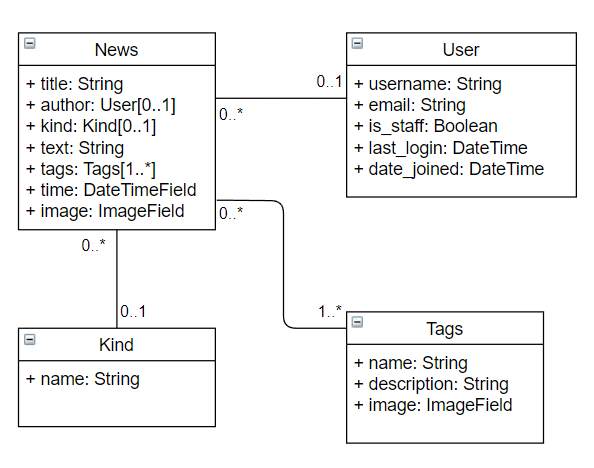

# EasyNews

## 数据库实验四

你为了一碟醋包一冰箱饺子的样子像极了小丑

啊什么，别人是一队小丑，我是一个小丑，输麻了

## 弱智向使用教学

1. 打开你的虚拟机，然后在终端上执行以下指令

    ```
    cd ~
    git clone https://github.com/Qing-LKY/EasyNews.git
    cd EasyNews
    ```

    **什么，你 clone 不下来？那你自己想办法。**

2. 创建虚拟环境并装包

    ```
    python3 -m venv .env
    source .env/bin/activate
    ```

3. 在 mysql 中创建数据库和用户

    ```sql
    create database easynews;
    create user easynews identified by 'easynews';
    grant all privileges on *.* to 'easynews';
    ```

4. 进行数据迁移

    ```
    python3 manage.py makemigrations
    python3 manage.py migrate
    ```

5. 创建超级用户

    ```
    python3 manage.py createsuperuser
    ```

6. 可以在本地运行网站了

    ```
    python3 manage.py runserver
    ```

    在 [127.0.0.1:8000/admin](http://127.0.0.1:8000/admin) 里用你的用户登录然后添加动态、话题和其它用户

    如果你嫌麻烦不想自己手动添加，可以参考下面的数据恢复方法，导入我的 json 文件(这个文件我不会包含在这个项目中，自己去群里找我要)

    当然，这样做的话会导致图片加载出问题，所以你还得找我要图片

    访问 [127.0.0.1:8000/](http://127.0.0.1:8000/) 看看效果

其它问题访问[这个](https://www.baidu.com/)大概率能解决。

## 参考文档、教程、项目

- [无敌的 xygg 的项目](https://github.com/xinyangli/locallib)

- [Mdn Web Docs](https://developer.mozilla.org/zh-CN/docs/Learn/Server-side/Django)

- [django documentation](https://docs.djangoproject.com/en/4.0/)

- [Mdn django-locallibrary-tutorial](https://github.com/mdn/django-locallibrary-tutorial)

- [Mdn django-diy-blog](https://github.com/mdn/django-diy-blog)

## 测试方式

- 使用 django-admin check

  ```
  django-admin check
  django-admin check --tag models --tag compatibility
  ```

- 并发测试
  
  使用 apache 工具 ab 模拟高并发的访问

  ```
  ab -n num_request -c num_vistor http://127.0.0.1:8000
  ab -t num_second -c num_request http://127.0.0.1:8000
  ```

## 数据备份和恢复

- 数据备份

  ```
  ./manager.py dumpdata > db.json
  ```

- 数据恢复

  ```
  ./manager.py loaddata db.json
  ```

- 如果你在这过程中出现什么问题，可以考虑将 ./catalog/migrations 里除了 \_\_init\_\_.py 的文件全部删掉

## ER 图

- 在 [freedgo](https://www.freedgo.com/) 上手动画的

  **注意，github 上的图片是存在 https://raw.githubusercontent.com/ 上的。如果你看不到下面的图片，请自行想办法。**

  

## 未来

- 添加有趣的内容

- 美化
